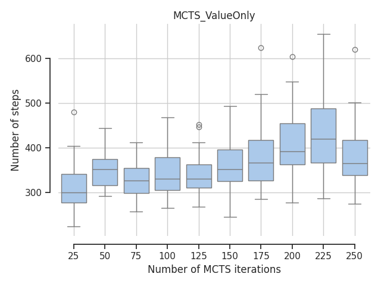

# Monte Carlo Tree Search 

by Tim Niklas Witte

An implementation of the Monte Carlo Tree Search (MCTS) algorithm for the [Cart Pole environment](https://www.gymlibrary.dev/environments/classic_control/cart_pole/).
There are the following two variants:
`MCTS_ValueOnly` which only considers the value of a state which is being rollout i.e. ignores intermediate rewards.
`MCTS_Reward` which considers intermediate rewards.

# Usage

## Run MCTS

Run `RunMCTS.py` to execute the desired MCTS variant selected by the `mode` terminal line argument.
The results are stored at `./[name of MCTS variant]/num_steps_X.npy` where `X` indicates the step number.

```
usage: RunMCTS.py [-h] --start START --stop STOP --step STEP --procs PROCS
                  --mode MODE

Let the Monte Carlo Tree Search algorithm play multiple episodes in the Cart
Pole environment concurrently.

optional arguments:
  -h, --help     show this help message and exit
  --start START  Set the start number of MCTS steps.
  --stop STOP    Set the end number of MCTS steps (inclusive).
  --step STEP    Set the step number going from start to end number of MCTS
                 steps.
  --procs PROCS  Set the number of processes.
  --mode MODE    Set the type of the MCTS algorithm: 0 = MCTS_ValueOnly, 1 =
                 MCTS_Reward.
```

## Display performance

Execute `./plotting/PlotPerformance.py` to display a boxplot of the performance of a MCTS variant
selected by the `mode` terminal line argument.
The performance is measured in terms of the number of steps during an episode.

```
usage: PlotPerformance.py [-h] --start START --stop STOP --step STEP --mode
                          MODE

Visualize the performance of the Monte Carlo Tree Search algorithm given its
step number in form of a boxplot.

optional arguments:
  -h, --help     show this help message and exit
  --start START  Set the start number of MCTS steps.
  --stop STOP    Set the end number of MCTS steps (inclusive).
  --step STEP    Set the step number going from start to end number of MCTS
                 steps.
  --mode MODE    Set the type of the MCTS algorithm: 0 = MCTS_ValueOnly, 1 =
                 MCTS_Reward.
```


## Evaluation




